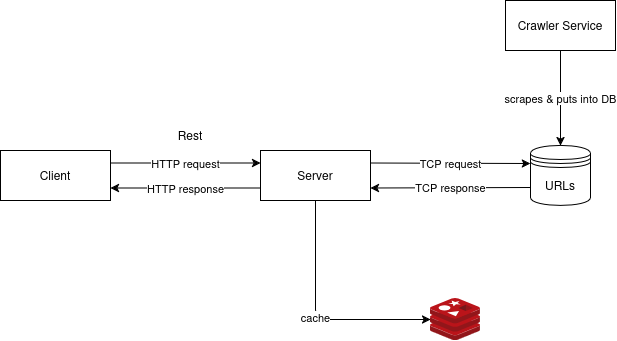

# My Little Eye

## About:

My Little Eye is an open-source search engine focusing on performance currently under development.

This repository is for the web crawler to scrape URLs and their contents to store into a database. 

## High-level architecture overview:



## Technologies used:

For the web crawler:

- Language: C++20
- Build generator: <a href="https://cmake.org/documentation/">CMake</a> $\geq3.18$
- Package manager: Python 3 (for building with Conan), <a href="https://conan.io/">Conan 2.0</a>
- Crawl state: <a href="https://www.scylladb.com/">ScyllaDB</a> (to be integrated)
- URL storage: Postgresql + Elasticsearch (to be integrated)

## Building project:

The current build system works as follows:

1. Set up build environment:

The code is going to be built in the `build` directory:

```bash
$ mkdir build
```

2. Install Conan:

The project uses libraries that are listed in `conanfile.py`; to install the dependencies. To gather said dependencies, install Conan and run conanfile:

```bash
# create virtual environment for project
$ python3 -m venv .venv

# activate the virtual environment (for UNIX machine)
$ source .venv/bin/activate  

# install Conan
$ pip3 install conan
```

3. Install dependencies:

While in the project's root directory:

```bash
# install all dependencies listed in conanfile.py; 
# replace "Release" with debug if under development
$ conan install . -sbuild_type=Release -of=build --build=missing

$ cd build
```

After running the commands, you should see the following structure (example structure; does not reflect the actual files in project):
```
.
└── build
    └── Release
        └── generators
            ├── cmakedeps_macros.cmake
            ├── CMakePresets.json
            ├── conanbuildenv-release-x86_64.sh
            ├── conanbuild.sh
            ├── conandeps_legacy.cmake
            ├── conanrunenv-release-x86_64.sh
            ├── conanrun.sh
            ├── conan_toolchain.cmake
            ├── deactivate_conanbuild.sh
            ├── deactivate_conanrun.sh
            ├── llhttp-config.cmake
            ├── llhttp-config-version.cmake
            ├── llhttp-release-x86_64-data.cmake
            ├── llhttp-Target-release.cmake
            ├── llhttpTargets.cmake
            ├── Microsoft.GSLConfig.cmake
            ├── Microsoft.GSLConfigVersion.cmake
            ├── Microsoft.GSL-release-x86_64-data.cmake
            ├── Microsoft.GSL-Target-release.cmake
            ├── Microsoft.GSLTargets.cmake
            ├── stduuid-config.cmake
            ├── stduuid-config-version.cmake
            ├── stduuid-release-x86_64-data.cmake
            ├── stduuid-Target-release.cmake
            └── stduuidTargets.cmake
```

4. Running the code:

To build and run the code: 

``` bash
# currently in build directory
$ cmake .. \
    -DCMAKE_TOOLCHAIN_FILE=build/Release/generators/conan_toolchain.cmake \
    -DCMAKE_BUILD_TYPE=Release \
    -DCMAKE_EXPORT_COMPILE_COMMANDS=1

$ cmake --build build

# assuming you're on a UNIX machine
$ ./src/main
```