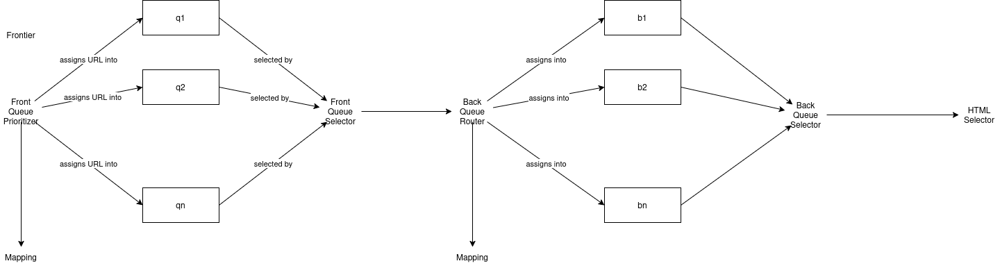

# **Frontier: Preparing URLs for crawling**

### **1. Overview of Frontier architecture**:

The Frontier component of the web crawler ensures politeness and prioritization of important URLs. This is achieved via the Front Queues and Back Queues system:

### **2. Front Queues system**:

- <a href="front_queues.h">Front Queues</a>:

A set of $Q_f$ lock-free queues ($Q_f$ defined by user when building frontier). 

The queues' order signify the importance of the URLs in which they reside, with $q_1, q_2$ being the most important and should be prioritized when crawling, and $q_{Q_f-1}, q_{Q_f}$ being the least important. This should be taken note when defining the actual Prioritizer and Front Selector.

- <a href="i_front_prioritizer.h">Front Queue Prioritizer</a>:

Given a URL (as a string), rank the URL's importance on a range of $0$ to $Q_f-1$ and place it into the respective queue. 

Implementer of prioritizer should be able to intelligently determine URL's importance based on a multitude of factors (e.g. website traffic, page links, update frequency,...) for the crawler to crawl efficiently. It should be noted that the selector object must be thread-safe (can either be stateless or has appropriate concurrency model in place).

- <a href="i_front_selector.h">Front Queue Selector</a>:

