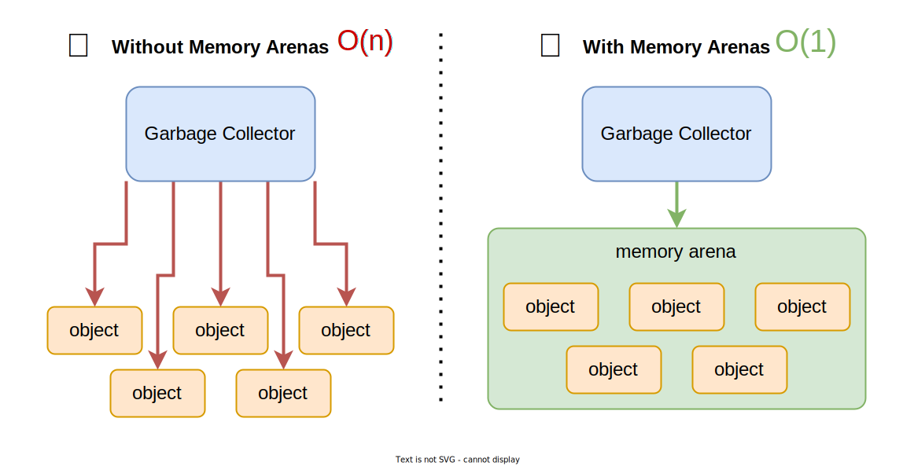

# Memory

This directory implements custom algoritms/data structures managing memory:

### 1. Memory Arena (<a href="arena.h">arena.h</a>):

A memory arena is a special data structure for allocating data for variables.

A common pitfall of manual memory management in C/C++ is knowing when to deallocate certain memory blocks on the heap when their purposes have been fulfilled, since one wrong move means potential memory leaks or use-after-free.

Management tools/concepts have been proposed to ensure memory errors are prevented, like garbage collector or ownership system (implemented as smart pointers in C++ or default behavior in Rust). However, the performance overhead caused by the garbage collector means it is not suitable for systems demanding high performance (e.g. trading systems or game engines). Though the ownership system is a sound solution to prevent undefined memory behavior, another equally interesting approach is a (memory) arena.

Instead of allocating all necessary variables via multiple heap allocations, one might create a giant chunk of memory and allocate necessary data in there. That way, should one decide the lifetime of the variables have ended, one single heap deallocation for the arena is necessary to delete all the data within the scope. 

Not only does this ensure data is deallocated at the correct moment; it is also more efficient. Assuming that within the scope one is to make $N$ heap allocations for $N$ variables (so $N$ syscalls), they must also perform $N$ syscalls to deallocate the data. Instead, they can perform only 1 syscall each for allocation and deallocation for said $N$ elements.   

A memory arena is most appropriately used if one recognizes there is significant amount of data that is related to one specific task, and that data is freed at the same time (e.g. sending a HTTP response).

**Visualization:**

Individual heap allocations vs allocation on memory arena (image taken from Pyroscope):



**Implementation:**

An implementation of a memory arena is provided in <a href="arena.h">`arena.h`</a> and <a href="arena.cpp">`arena.cpp`</a>. 

To create a memory arena, specify the number of bytes:

```cpp
#include "memory/arena.h"

Arena arena(120); // create an arena of 120 bytes  
```

To allocate memory with certain data (analogous to `new` operator), call `allocate` as follows:

```cpp
struct Point {
    int x, y;
    Point(int x, int y) : x(x), y(y) {}
};

Point* p = arena.allocate<Point>(3, 4);

// prints "Allocated Point: 3 4"
std::cout << "Allocated Point: " << p->x << ' ' << p->y << '\n';

int* pint = arena.allocate<int>(12);

// prints "Allocated int: 12"
std::cout << "Allocated int: " << *pint << '\n';
```

We can also keep track of how much memory has been allocated via `capacity` and `occupiedMemory`

```cpp
// prints "Memory left: 108"
std::cout << "Memory left: " << arena.capacity() - arena.occupiedMemory() << '\n';
```